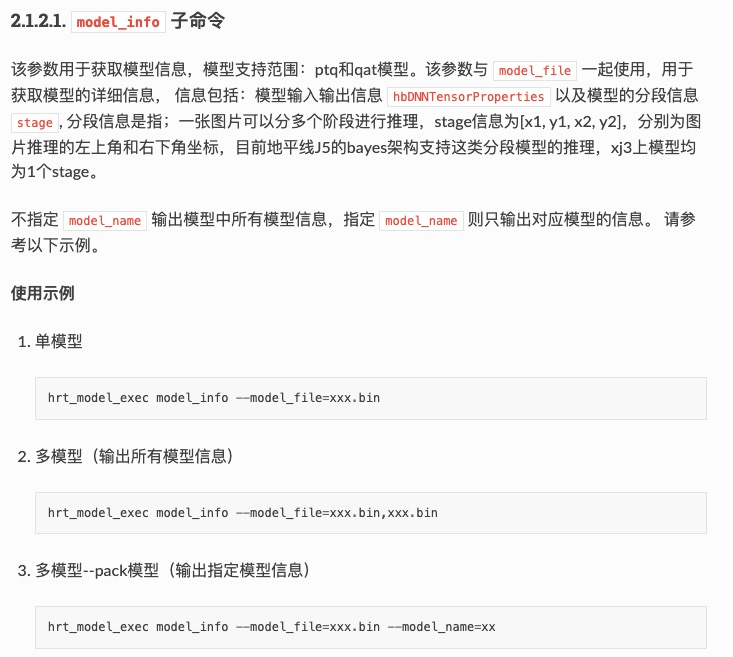
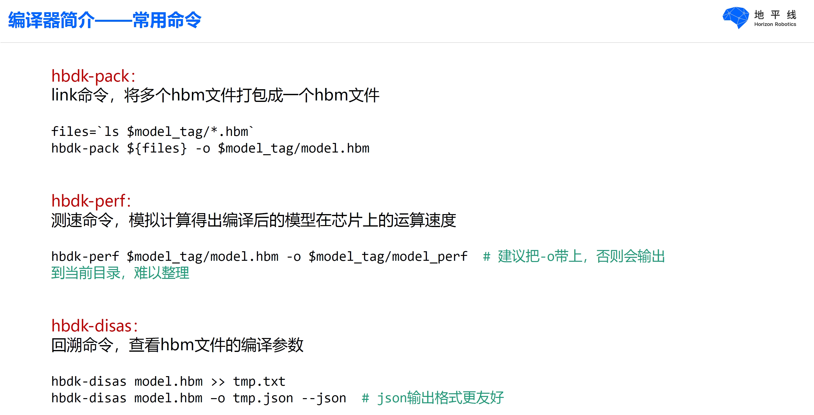
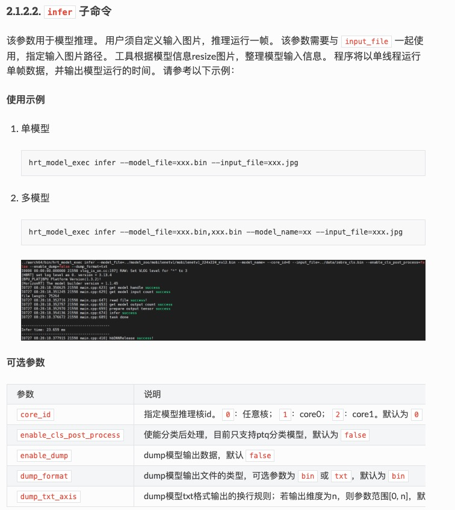
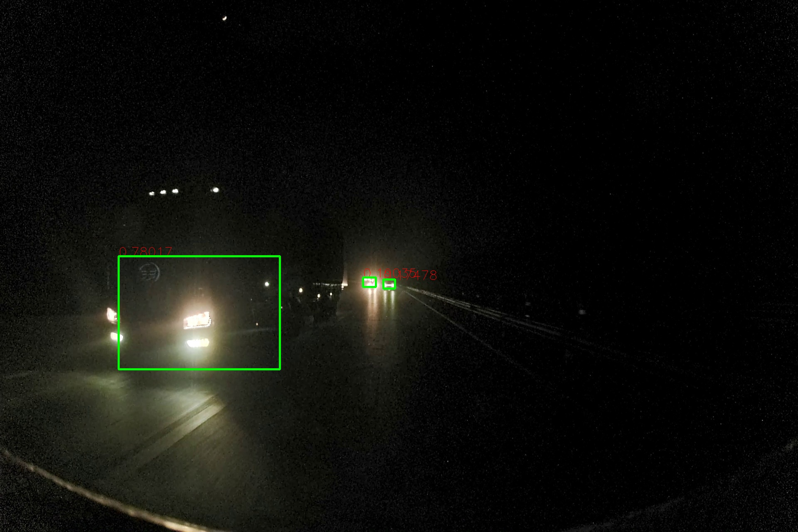

# Deploy  模型部署到J5，附性能分析

# 一、 性能分析使用说明 performance_analysis_tool
  hrt_model_exec工具介绍
  hrt_model_exec 是一个模型执行工具，可直接在开发板上评测模型的推理性能、获取模型信息。 一方面可以让用户拿到模型时实际了解模型真实性能； 另一方面也可以帮助用户了解模型可以做到的速度极限，对于应用调优的目标极限具有指导意义。
  hrt_model_exec 工具分别提供了模型推理 infer、模型性能分析 perf 和查看模型信息 model_info 三类功能，具体介绍如下：

  https://developer.horizon.ai/api/v1/fileData/horizon_j5_open_explorer_v1_1_33_cn_doc/runtime/source/tool_introduction/source/hrt_model_exec.html?highlight=hrt_model_exec

# 二、 网络回灌模式的J5模型可视化 model_visualization_on_J5
  使用方法见子文件自述文档

# 三、 编译环境搭建 compile_tools
  
  跟地平线内部各工具版本要对齐 
  编译工具: hbdk_model_verifier-3.28.2-py3-none-linux_x86_64.whl
  docker环境:reg-ai.chehejia.com/j5/hat_pilot_development_toolkit:1.1.1 
  工作目录: /release_package
  编译命令为:
  python3 -u projects/pilot/model_release/upload_compile_model.py --pub-config projects/pilot/model_release/cfg/pub_cfg_x3c.py

# 四、 Python版 J5模型可视化 model_infer_visualization_with_python
  
  ## step 1. 模型编译, 见目录三 

  ## step 2. 模型信息确认, 检查模型的各层输出是否有错误

     登录板端ssh root@10.248.196.252, 执行./hrt_model_exec model_info --model_file model/model.hbm

     此命令的具体介绍如下:
  ,

     输出见 model_infer_visualization_with_python/model_info_20220616.json
  [model_info.json](model_infer_visualization_with_python/model_info.json)

     如果输出更详细的模型信息,使用hbdk_disas命令,介绍如下:
     使用docker环境:reg-ai.chehejia.com/j5/hat_pilot_development_toolkit:1.1.1 

  

     其示例输出如下:
  [model_info.json](model_infer_visualization_with_python/model_info_20220616.json)

  ## step 3. 模型一致性检查,检查编译前的.pt模型文件和编译后的.hbm各层参数是否一致

     docker环境:reg-ai.chehejia.com/j5/hat_pilot_development_toolkit:1.1.1 
     一致性评测工具 hbdk_model_verifier-3.28.2-py3-none-linux_x86_64.whl
  [hbdk_model_verifier](model_infer_visualization_with_python/hrt_model_exec)  

     使用方法: 进入docker, 需要跟板端J5通信,因此docker的部署位置需要能跟板端联网的主机,具体指令如下:

     hbdk-model-verifier --hbm tmp_compile_bayes_x3c_20220616/tmp_compile_bayes_x3c/model.hbm --model-name pilot_legorcnn_multitask_resize_2 --model-pt tmp_compile_bayes_x3c_20220616/tmp_output/pilot_multitask_resize2/int_infer_pilot_legorcnn_multitask_resize_2_day_torch_bayes-deploy-checkpoint-last.pt --ip 10.248.196.252

     输出文件如下:

  [diff_file_day](model_infer_visualization_with_python/day_diff.txt)
  [diff_file_night](model_infer_visualization_with_python/night_diff.txt)

     文件中各层信息逐层对比, 如果有failed信息,则说明一致性检查未通过. 如果一致性检查通过, 则进行下一步

  ## step 4. 板端模型推理 利用板端算力,进行模型推理,得到结果

     该命令的使用方法如下:

  

     登录板端ssh root@10.248.196.252, 执行

     ./hrt_model_exe infer --model_file=xxx.bin,xxx.hbm --model_name=xx --input_file=xxx.jpg --enable_dump=true --dump_format=txt 

     生成推理输出的txt文件,文件个数与step 2中model_info信息一致,各层一一对应,示例如下:

  [model_infer_input_0](model_infer_visualization_with_python/infer_output/model_infer_output_0.txt)

  ## step 5. 推理结果解析并可视化

     使用环境: 装有python3, numpy和python-opencv的机器即可
     根据各层的输出信息, 解析输出结果.例如本例中,infer out 0,1,2分别为车辆的初始检测框anchor_pred, 每个框的置信度bbox_score,和每个框的回归框即框的修正量bbox_reg
     根据解析规则和各层的信息(model_info.json)对脚本进行配置,并运行解析可视化脚本: python3 anchor_visualization.py

     主要的配置参数包括:

         要解析的推理输出路径,本例中分别为infer out_0.txt ,infer out_1.txt ,infer out_2.txt
         每一层输出的resize尺寸和缩放因子
         非极大值抑制NMS的阈值

     具体脚本内容如下:
  [anchor_visualization.py](model_infer_visualization_with_python/anchor_visualization.py)

     输出的可视化结果如下:
  

     根据输出的结果, 直观检测模型的输出是否符合预期

     如果以上步骤都完成后,模型均无问题,就能上板部署了
