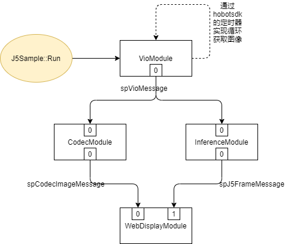

# Sample用例

## 一. 介绍
此用例展示如何在J5上运行一个检测模型并展示结果, 结果包括物体框和全图分割数据。

## 二. 程序原理
本示例使用hobotsdk框架，实现了VioModule、InferenceModule、CodecModule和WebDisplayModule，其关系如下图所示：

- VioModule：获取图像数据，支持网络回灌和camera两种模式
- InferenceModule：获取Vio图像数据，调用dnn接口执行预测任务，获取智能结果
- CodecModule：获取Vio图像nv12数据，编码为jpg格式数据输出
- WebDisplayModule：获取智能结果和编码后的jpg数据，通过websocket发送到web展示

## 二. 编译与部署
 ```
  bash build_and_deploy.sh
 ```
会生成一个deploy目录，将该目录拷贝到J5板子上


## 三. 运行
进入deploy文件夹，执行
```
sh run_sample.sh d
```
d表示log的debug级别，支持i/d/w/e/f
默认是camera模式; 回灌模式修改配置文件后,cam_index设置为2,重新运行即可

### 1. camera模式
目前支持的摄像头列表：
- max9296+ar0233(SENSING Fov216)
  - configs/vio/j5_vio_config.json文件中config_index设置为0
  - configs/vio/vin/camera/j5_camera_source.json文件中cam_index设置为0
- max96712+ar0233(SUNNY Fov100)
  - configs/vio/j5_vio_config.json文件中config_index设置为2
  - configs/vio/vin/camera/j5_camera_source.json文件中cam_index设置为1


### 2. 网络回灌模式
进入deplgoy文件夹，修改配置文件：
```
vi configs/vio/j5_vio_config.json
```
修改`config_index`字段为'1'即是网络回灌模式

网络回灌Client端工具在tools/network_send目录下，基于python3语言编写

### 3. 如何使用
1) 将需要回灌的jpeg图像存放在tools/network_send/images/目录下:
```
|── tools
    ├── network_send
    │   ├── images
    │   ├── pc_send.py
    │   └── test_pb2.py
```
2) 在服务器上运行:
```
   python3 pc_send.py --input_file_path ./images --board_ip 10.64.61.209 --is_loop true
```
参数说明：
```
a) input_file_path: 指定回灌图像的文件夹，文件夹中的图片将依次发送出去
b) board_ip: 需要发送的目标地平线j5板的ip地址
c) is_loop:  是否循环发送input_file_path中的图片。取值是false，则发送一轮就结束；取值是true，则将会一轮一轮的不停发送。

```
## 四. 结果保存与可视化
可以在本地保存结果,也可以在网络端进行可视化

### 1. 本地结果保存
在codec_modeule.cc中, 设置bool dump_en = true; int dump_num = -1,即可开启image dump模式,设置save_path路径保存图片结果,现阶段保存的结果是原图dump的结果,后续会将检测框绘制在原图上.

### 2. 网络端可视化
在与板端连通的服务器浏览器中输入board_ip, 即可看到有检测框的可视化图片. 右上角导航键可以配置可视化选项,勾选感兴趣的输出即可

## 五. Todo list

不同模型的适配问题.
配置文件的流程完善.